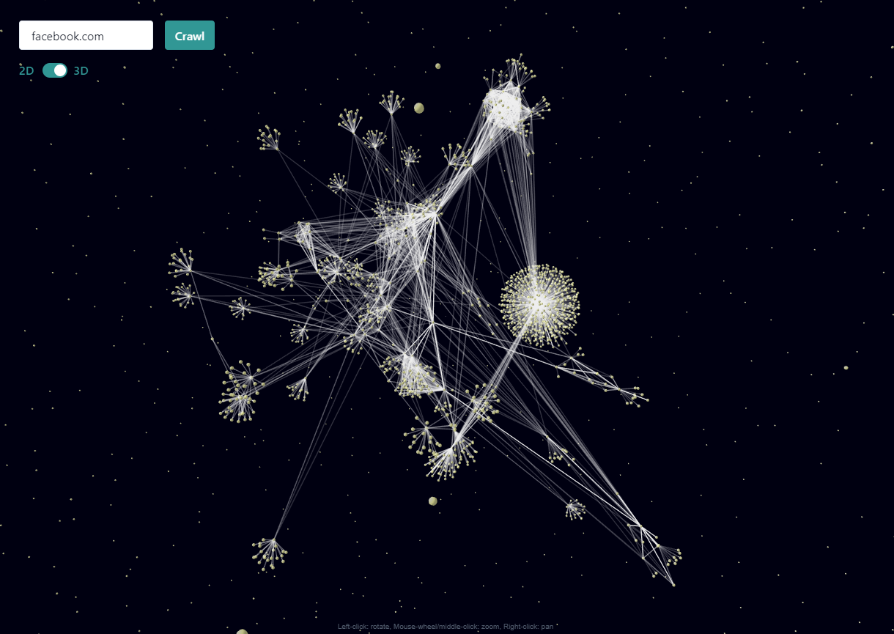

# link-vis

Check it out in action: [link-vis.oalashqar.me](https://link-vis.oalashqar.me)

Mini project that visualizes the graph network generated by following `href` website links starting from a user-provided URL.

The web server is written in `Golang` and acts as a web crawling service. Then, the `React.js` client renders the result using a graph visualization library.

The result is pretty cool! :fire:

Note that the web-crawler follows 10 redirects and has a max depth of 3, for now.
The lonely nodes are likely a result of an 11th redirect or possibly a buy in my code. Both ways, they make the visualization look like constellations so I'm considering it a feature.

### TODO

- [ ] Cache total results
- [ ] Cache URL results
- [ ] Stream partial data as it's being built
- [ ] Return partial data before it disconnects if a crash will happen
- [ ] Option for internal links only (site-map generator)
- [ ] Option for max depth (within limits)

### Motivation

This project is mainly a conduit for me to try out `Golang` and possibly write my own multi-threaded web crawler in place of the web-crawling library I initially used.

### Reflection

`Golang` is pretty cool. At the time of writing this, it's at version 1.15 and it seems that it has grown quite a bit as evident from the solid tooling around it (and all the fixed workarounds I stumbled upon on the internet).

The idea behind it seems to keep complexity at bay by keeping everything as simple as possible. This comes at a price as you say good-bye to some helpful language features, but the end result is a simpler environment to work with.

The concurrency models and primitives are a delight to use compared to POSIX pthreads in `C`, so that's where `Golang` shines.

I've also heard that `Rust` goes one step beyond and ensures race-condition free code with concurrency due to a more strict system. However, `Golang` targets web services and `Rust` targets systems programming.
